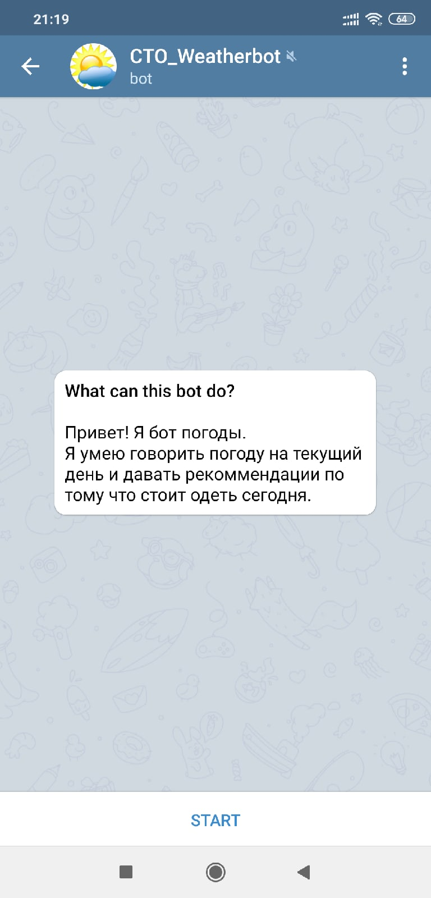
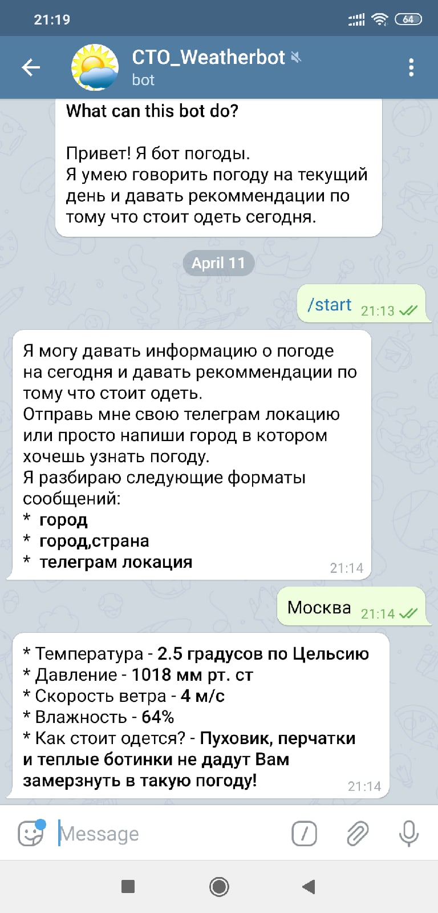
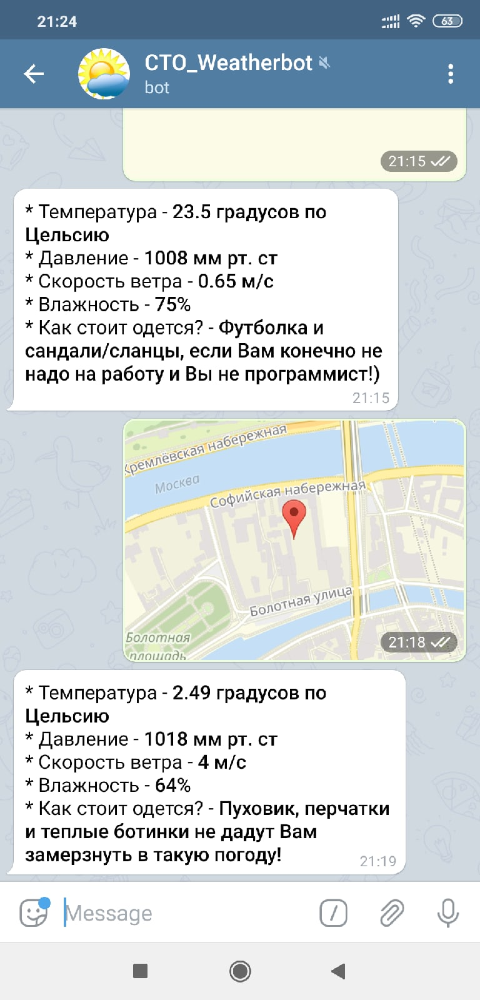

###  Телеграм бот для погоды - CTO_Weatherbot (t.me/cto_weather_bot)
 
#### Проектирование сервиса
 1. Язык программирования и технологии - написан на Python c использованием API Телеграма
 2. Формат ответа
    * API OpenWeatherMap возвращает json, из которого сервис берет нужные поля и вставляет в шаблон ответа. 
    Одно поле json - feels_like обрабатывается дополнительно, чтобы сформировать рекомендации по одежде.
    
    Формат ответа: 
    Температура - ___ градусов по Цельсию Давление - ___ мм рт. ст Скорость ветра - ___ м/с Влажность - ___% Как стоит одется? - ___
 
#### Процесс работы программы
 1. Данные приходят от пользователя через интерфейс Телеграма
 2. Формируется и отправляется запрос к  API OpenWeatherMap.com
 3. Полученный ответ сервиса используется для формирования ответа пользователю
 4. Ответ отправляется в телеграм с помощью API Телеграма 

#### Запуск чат-бота
 1. Склонировать себе репозиторий
 2. Переименовать файл config_example.yaml в config.yaml и вписать свои токены для Телеграм, OWM, а также свой прокси север(в примере мой)
 3. Запустить
 
 
#### Пример работы приложения:

